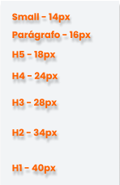
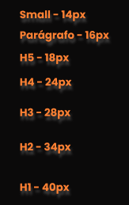

# **`Manual de cores da empresa Itaú 🟧`**

#### O documento exibe toda a caracterização e configuração de aparencia da marca Itaú 🟧🟦⬜ ####
##### ✏️🗒️ Contendo tópicos como, logo, tipografia, font scale, paleta de cores e contraste das cores 🗒️✏️ #####

 
  
<h2>Informações relevantes ‼️</h2>

  ---

<table>
  <tr>
    <td>
       
       
       
    </td>
  </tr>
</table>

---

⬜🟧 Na primeira imagem foi feita a mesclagem com o fundo na cor light e as letras na cor primário ⬜🟧 
 🟧⬜ Na segunda imagem foi feita a mesclagem com o fundo na cor primário e as letras na cor light 🟧⬜ 
 ⬛🟧 Na terceira imagem foi feita a mesclagem com o fundo na cor dark +1 e as letras na cor primário +1 ⬛🟧 

---

